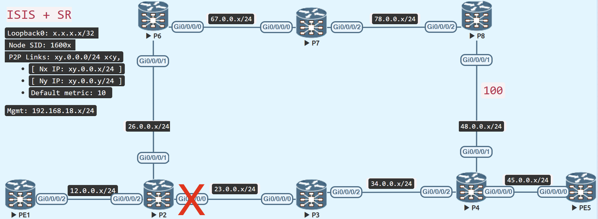

# Double Segment TI-LFA (Topology Independent - LoopFree Alternate)

<figure markdown>
  { loading=lazy }
  <figcaption>Double Segment TI-LFA</figcaption>
</figure>

Double Segment TI-LFA is a backup route in which the router delivers traffic to the destination after adding two additional segment to the original segment in the event of a local link failure.

## Prepare the topology
Change the metric between P8 and P4 in the same topology used for single segment ti-lfa to 100.

=== "P8"
    ```java
    router isis IGP
     interface GigabitEthernet0/0/0/1
      address-family ipv4 unicast
       metric 100
    ```

=== "P4"
    ```jav
    router isis IGP
     interface GigabitEthernet0/0/0/1
      address-family ipv4 unicast
       metric 100
    ```

## Verify

=== "P2's P-space"
    ```
    Routers P2 can reach without using P2 - P3 link (excluding ECMP)
        1. P6
        2. P7
    ```

=== "P-space of P6 (P2's neighbor)"
    ```
    Routers P6 can reach without using P2 - P3 link
        1. P7
        2. P8
    ```

=== "Extended P-space of P2, with respect to P2 - P3 link"
    ```
    1. P6
    2. P7
    3. P8
    ```

---
=== "Q-space of PE5"
    ```
    Routers which can reach PE5 without using P2 - P3 link (excluding ECMP)
        1. P4
    ```

There is no PQ router, which is in both Extended-P-Space and Q-Space.

The traffic now needs to be directed from the P-node to the Q-node, by using the Adj-SID label of the link on the P-node, towards the Q-node.

Because all routers advertise their Prefix-SID index and Adj-SID value in the ISIS LSP, P2 is aware of the Adj-SID of the P8 - P4 link.

P2 forms a label stack for the backup path using Adj-SID information from its ISIS LSDB to direct traffic to the target on the post-convergence path.

P8 is located in P-space (or P-node) (P2 can send traffic to P8 without any risk of it flowing via P2 – P-RR3).

P4 is located in Q-space (or Q-node) (P4 can send the traffic to the destination without any risk of it flowing via P2 – P-RR3)


=== "P8 to PE5 via P2 - P3"
```java
RP/0/RP0/CPU0:P8#traceroute sr-mpls 5.5.5.5/32
Wed Feb  1 07:37:11.392 UTC

Tracing MPLS Label Switched Path to 5.5.5.5/32, timeout is 2 seconds

Codes: '!' - success, 'Q' - request not sent, '.' - timeout,
  'L' - labeled output interface, 'B' - unlabeled output interface,
  'D' - DS Map mismatch, 'F' - no FEC mapping, 'f' - FEC mismatch,
  'M' - malformed request, 'm' - unsupported tlvs, 'N' - no rx label,
  'P' - no rx intf label prot, 'p' - premature termination of LSP,
  'R' - transit router, 'I' - unknown upstream index,
  'X' - unknown return code, 'x' - return code 0

Type escape sequence to abort.

  0 78.0.0.8 MRU 1500 [Labels: 16005 Exp: 0]
L 1 78.0.0.7 MRU 1500 [Labels: 16005 Exp: 0] 10 ms
L 2 67.0.0.6 MRU 1500 [Labels: 16005 Exp: 0] 19 ms
L 3 26.0.0.2 MRU 1500 [Labels: 16005 Exp: 0] 10 ms
L 4 23.0.0.3 MRU 1500 [Labels: 16005 Exp: 0] 14 ms
L 5 34.0.0.4 MRU 1500 [Labels: implicit-null Exp: 0] 11 ms
! 6 45.0.0.5 19 ms
RP/0/RP0/CPU0:P8#
```

---
=== "P8 Adjacencny-SID to P4"
```java
RP/0/RP0/CPU0:P8#show isis adjacency detail
Wed Feb  1 07:37:15.047 UTC

IS-IS IGP Level-2 adjacencies:
System Id      Interface                SNPA           State Hold Changed  NSF IPv4 IPv6
                                                                               BFD  BFD
P4             Gi0/0/0/1                *PtoP*         Up    29   04:39:48 Yes None None
  Area Address:           49
  Neighbor IPv4 Address:  48.0.0.4*
  Adjacency SID:          24016 (protected)
   Backup label stack:    [16004]
   Backup stack size:     1
   Backup interface:      Gi0/0/0/2
   Backup nexthop:        78.0.0.7
   Backup node address:   4.4.4.4
  Non-FRR Adjacency SID:  24017
  Topology:               IPv4 Unicast
  BFD Status:             BFD Not Required, Neighbor Useable
<..snipped..>
```

---
=== "Double Segment TI-LFA"
```java
RP/0/RP0/CPU0:P2#show isis fast-reroute 5.5.5.5/32 detail
Wed Feb  1 07:37:33.441 UTC

L2 5.5.5.5/32 [30/115] Label: 16005, medium priority
   Installed Feb 01 07:35:51.435 for 00:01:42
     via 23.0.0.3, GigabitEthernet0/0/0/0, Label: 16005, P3, SRGB Base: 16000, Weight: 0
       Backup path: TI-LFA (link), via 26.0.0.6, GigabitEthernet0/0/0/1 P6, SRGB Base: 16000, Weight: 0, Metric: 140
         P node: P8.00 [8.8.8.8], Label: 16008
         Q node: P4.00 [4.4.4.4], Label: 24017   // (1)
         Prefix label: 16005                    
         Backup-src: PE5.00
       P: No, TM: 140, LC: No, NP: No, D: No, SRLG: Yes
     src PE5.00-00, 5.5.5.5, prefix-SID index 5, R:0 N:1 P:0 E:0 V:0 L:0, Alg:0
RP/0/RP0/CPU0:P2#

RP/0/RP0/CPU0:P2#show cef 5.5.5.5/32
Wed Feb  1 07:37:45.928 UTC
5.5.5.5/32, version 468, labeled SR, internal 0x1000001 0x8310 (ptr 0xe727de0) [1], 0x600 (0xe190578), 0xa28 (0xf54aaf8)
 Updated Feb  1 07:35:51.441
 remote adjacency to GigabitEthernet0/0/0/0
 Prefix Len 32, traffic index 0, precedence n/a, priority 1
  gateway array (0xdff9d60) reference count 6, flags 0x500068, source rib (7), 1 backups
                [3 type 5 flags 0x8401 (0xeb73f48) ext 0x0 (0x0)]
  LW-LDI[type=5, refc=3, ptr=0xe190578, sh-ldi=0xeb73f48]
  gateway array update type-time 1 Feb  1 07:35:51.441
 LDI Update time Feb  1 07:35:51.447
 LW-LDI-TS Feb  1 07:35:51.447
   via 23.0.0.3/32, GigabitEthernet0/0/0/0, 10 dependencies, weight 0, class 0, protected [flags 0x400]
    path-idx 0 bkup-idx 1 NHID 0x0 [0xdda5820 0x0]
    next hop 23.0.0.3/32
     local label 16005      labels imposed {16005}
   via 26.0.0.6/32, GigabitEthernet0/0/0/1, 11 dependencies, weight 0, class 0, backup (TI-LFA) [flags 0xb00]
    path-idx 1 NHID 0x0 [0xf399970 0x0]
    next hop 26.0.0.6/32, Repair Node(s): 8.8.8.8, 4.4.4.4
    remote adjacency
     local label 16005      labels imposed {16008 24017 16005}  // (2)

    Load distribution: 0 (refcount 3)

    Hash  OK  Interface                 Address
    0     Y   GigabitEthernet0/0/0/0    remote
RP/0/RP0/CPU0:P2#
```

1. P8's Adj-SID label to P4 is used to direct the backup path to PE5
2. Backup path is sent to P8 and then directed to P4 

## Restore the metrics
=== "P8"
    ```java
    router isis IGP
     interface GigabitEthernet0/0/0/1
      address-family ipv4 unicast
       metric 10
    ```
    
=== "P4"
    ```java
    router isis IGP
     interface GigabitEthernet0/0/0/1
      address-family ipv4 unicast
       metric 10
    ```

