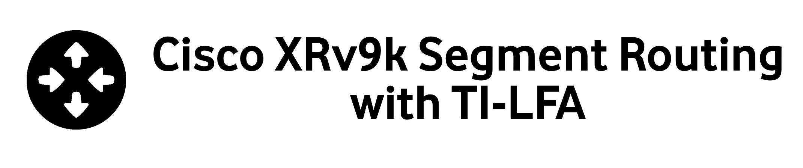

# Segment Routing

<figure markdown>
  { loading=lazy }
  <figcaption>Implementing Segment Routing with TI-LFA on Cisco XRv9k platform</figcaption>
</figure>

## Objective

The objective of this workshop is to run through a few [SR MPLS Tutorials](https://www.segment-routing.net/tutorials) scenarios in the lab.

Thank you so much to the team for putting up the tutorials.

!!! info "Must Read"
    Because the purpose of the lab is to get practical experience, it is strongly recommended that you study those PDFs before joining the lab. The theory is not discussed in depth, and the majority of the guide is self-explanatory.

!!! warning "Out of Scope"
    The guide tries to cover the bare necessities for putting SR-ISIS and TI-LFA into action. The scope excludes SR-TE, Flex-Algo, and Delay Measurement.

## Topology Overview
<figure markdown>
  { loading=lazy }
  <figcaption>Base Topology</figcaption>
</figure>

+ The routers are all Cisco XRv9ks running 7.5.2 and are managed by the netdevops server[^1].
+ The guide starts with ISIS IGP and LDP configurations as the base transport, and each section progresses from the base state to the introduction of Segment Routing, eventually leading to a seamless migration to SR with TI-LFA.
+ The remaining scenarios would then put to the test the SR-ISIS transport reachability and TI-LFA-based FRR protection (variants thereof) from PE1 to PE5 or P2 to PE5.
+ A new router P9 would be put between P2 and P3 later in the tutorial.

[^1]: This lab is running in [EVE-NG Pro](https://www.eve-ng.net/).

*[SR]: Segment Routing
*[ISIS]: Intermediate System - Intermediate System
*[TI]: Topology Independent
*[LFA]: LoopFree Alternate
*[MPLS]: MultiProtocol Label Switching
*[PDF]: Portable Document Format
*[TE]: Traffic Engineering
*[IGP]: Interior Gateway Protocol
*[LDP]: Label Distribution Protocol
*[FRR]: Fast Re-Route
