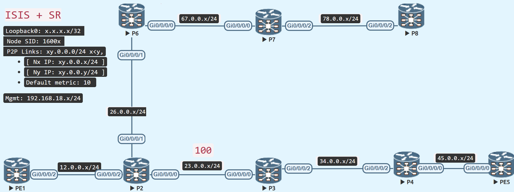

# Microloop Avoidance

<figure markdown>
  { loading=lazy }
  <figcaption>Microloop Avoidance</figcaption>
</figure>

Micro loops induce brief packet loss in the network during convergence; they can occur during both a link up and a link down event and result in packet loss.

In a FRR-enabled network, avoiding micro loops is desirable; enable micro loop avoidance on P2 for segment routing.

Microloop avoidance is locally significant to the router.


## Prepare the topology
Continuing with the previous topology, we disable the isis adjacency between P8 and P4 and raise the metric between P2 and P-RR3 to 100.

=== "P2"
    ```java
    router isis IGP
     interface GigabitEthernet0/0/0/0
      address-family ipv4 unicast
       metric 100
    ```

=== "P8"
    ```java
    router isis IGP
     interface GigabitEthernet0/0/0/1
      shutdown
    ```

### Verify 
There is no other path to get to PE5 but through P3, which likewise applies to P6, P7, and P8.

```java
RP/0/RP0/CPU0:P2#show isis fast-reroute 5.5.5.5/32 detail
Wed Feb  1 07:47:01.246 UTC

L2 5.5.5.5/32 [120/115] Label: 16005, medium priority
   Installed Feb 01 07:46:48.159 for 00:00:13
     via 23.0.0.3, GigabitEthernet0/0/0/0, Label: 16005, P3, SRGB Base: 16000, Weight: 0
       No FRR backup
     src PE5.00-00, 5.5.5.5, prefix-SID index 5, R:0 N:1 P:0 E:0 V:0 L:0, Alg:0
RP/0/RP0/CPU0:P2#

RP/0/RP0/CPU0:P2#show route 5.5.5.5/32
Wed Feb  1 07:47:10.957 UTC

Routing entry for 5.5.5.5/32
  Known via "isis IGP", distance 115, metric 120, labeled SR, type level-2
  Installed Feb  1 07:46:48.159 for 00:00:22
  Routing Descriptor Blocks
    23.0.0.3, from 5.5.5.5, via GigabitEthernet0/0/0/0
      Route metric is 120
  No advertising protos.
RP/0/RP0/CPU0:P2#

RP/0/RP0/CPU0:P2#show cef 5.5.5.5/32
Wed Feb  1 07:47:14.307 UTC
5.5.5.5/32, version 562, labeled SR, internal 0x1000001 0x8310 (ptr 0xe727de0) [1], 0x600 (0xe190578), 0xa28 (0xeb30828)
 Updated Feb  1 07:46:48.167
 remote adjacency to GigabitEthernet0/0/0/0
 Prefix Len 32, traffic index 0, precedence n/a, priority 1
  gateway array (0xdff9e48) reference count 6, flags 0x68, source rib (7), 1 backups
                [3 type 5 flags 0x8401 (0xeb743c8) ext 0x0 (0x0)]
  LW-LDI[type=5, refc=3, ptr=0xe190578, sh-ldi=0xeb743c8]
  gateway array update type-time 1 Feb  1 07:46:48.167
 LDI Update time Feb  1 07:46:48.167
 LW-LDI-TS Feb  1 07:46:48.167
   via 23.0.0.3/32, GigabitEthernet0/0/0/0, 8 dependencies, weight 0, class 0 [flags 0x0]
    path-idx 0 NHID 0x0 [0xf399a10 0x0]
    next hop 23.0.0.3/32
    remote adjacency
     local label 16005      labels imposed {16005}

    Load distribution: 0 (refcount 3)

    Hash  OK  Interface                 Address
    0     Y   GigabitEthernet0/0/0/0    remote
RP/0/RP0/CPU0:P2#
```

## Enable Microloop Avoidance on P2

Configure a rib-update-delay of 60 seconds (max) to see the microloop avoidance in operation before the ISIS convergence.

=== "Configure Microloop Avoidance on P2"
```java
router isis IGP
 address-family ipv4 unicast
  microloop avoidance segment-routing
  microloop avoidance rib-update-delay 60000
```


### In Action: Microloop Avoidance

It's time to bring up the adjacency between P8 and P4 and check how microloop avoidance works.

=== "P8"
    ```java
    router isis IGP
     interface GigabitEthernet0/0/0/1
      no shutdown
    ```

P2 launches an explicit designated path to tunnel traffic via P8 and prevent microloops along the core path for a limited period of time (60 seconds in our arrangement).

!!! info "Microloop Avoidance Tunnel"
    The explicit path launched by the microloop avoidance mechanism, in contrast to the TI-LFA examples, is for the primary path, not the backup path. Until the IGP convergence is complete, the explicit path exists.


=== "P2"

```java
RP/0/RP0/CPU0:P2#show isis protocol | utility egrep -A2 Micro
Wed Feb  1 07:59:57.510 UTC

        Microloop avoidance: Enabled
          Configuration: Type: Segment routing, RIB update delay: 60000 msec
      No protocols redistributed
RP/0/RP0/CPU0:P2#

RP/0/RP0/CPU0:P2#show isis protocol | utility egrep -A2 Micro
Wed Feb  1 08:00:07.477 UTC
        Microloop avoidance: Enabled
          Configuration: Type: Segment routing, RIB update delay: 60000 msec
          State: Active, Duration: 2721 ms, Event Link up, Near: P8.00 Far: P4.00  // (1)
RP/0/RP0/CPU0:P2#

RP/0/RP0/CPU0:P2#show isis fast-reroute 5.5.5.5/32 detail
Wed Feb  1 08:00:18.127 UTC

L2 5.5.5.5/32 [50/115] Label: 16005, medium priority
   Installed Feb 01 08:00:04.866 for 00:00:14
     via 26.0.0.6, GigabitEthernet0/0/0/1, P6, SRGB Base: 16000, Weight: 0
       No FRR backup
     exp 26.0.0.6, GigabitEthernet0/0/0/1, P6, SRGB Base: 16000, Weight: 0  // (2)
       via explicit path
         P node: P8.00 [8.8.8.8], Label: 16008
         Q node: P4.00 [4.4.4.4], Label: 24017
         Prefix label: 16005
     src PE5.00-00, 5.5.5.5, prefix-SID index 5, R:0 N:1 P:0 E:0 V:0 L:0, Alg:0
RP/0/RP0/CPU0:P2#

RP/0/RP0/CPU0:P2#show route 5.5.5.5/32
Wed Feb  1 08:00:24.310 UTC

Routing entry for 5.5.5.5/32
  Known via "isis IGP", distance 115, metric 50, labeled SR, type level-2
  Installed Feb  1 08:00:04.867 for 00:00:19
  Routing Descriptor Blocks
    26.0.0.6, from 5.5.5.5, via GigabitEthernet0/0/0/1
      Route metric is 50
  No advertising protos.
RP/0/RP0/CPU0:P2#

RP/0/RP0/CPU0:P2#show route 5.5.5.5/32 detail
Wed Feb  1 08:00:28.633 UTC

Routing entry for 5.5.5.5/32
  Known via "isis IGP", distance 115, metric 50, labeled SR, type level-2
  Installed Feb  1 08:00:04.867 for 00:00:23
  Routing Descriptor Blocks
    26.0.0.6, from 5.5.5.5, via GigabitEthernet0/0/0/1
      Route metric is 50
      Labels: 0x3e88 0x5dd1 0x3e85 (16008 24017 16005)  // (3)
      Tunnel ID: None
      Binding Label: None
      Extended communities count: 0
      Path id:1       Path ref count:0
      NHID:0x2(Ref:15)
  Route version is 0x57 (87)
  Local Label: 0x3e85 (16005)
  IP Precedence: Not Set
  QoS Group ID: Not Set
  Flow-tag: Not Set
  Fwd-class: Not Set
  Route Priority: RIB_PRIORITY_NON_RECURSIVE_MEDIUM (7) SVD Type RIB_SVD_TYPE_LOCAL
  Download Priority 1, Download Version 848
  No advertising protos.
RP/0/RP0/CPU0:P2#

RP/0/RP0/CPU0:P2#show cef 5.5.5.5/32
Wed Feb  1 08:00:34.545 UTC
5.5.5.5/32, version 848, labeled SR, internal 0x1000001 0x8310 (ptr 0xe727de0) [1], 0x600 (0xe190578), 0xa28 (0xeb30dc8)
 Updated Feb  1 08:00:04.882
 remote adjacency to GigabitEthernet0/0/0/1
 Prefix Len 32, traffic index 0, precedence n/a, priority 1
  gateway array (0xdff9708) reference count 15, flags 0x68, source rib (7), 1 backups
                [6 type 5 flags 0x8401 (0xeb738e8) ext 0x0 (0x0)]
  LW-LDI[type=5, refc=3, ptr=0xe190578, sh-ldi=0xeb738e8]
  gateway array update type-time 1 Feb  1 07:58:24.077
 LDI Update time Feb  1 07:58:24.079
 LW-LDI-TS Feb  1 08:00:04.882
   via 26.0.0.6/32, GigabitEthernet0/0/0/1, 10 dependencies, weight 0, class 0 [flags 0x0]
    path-idx 0 NHID 0x0 [0xf399970 0x0]
    next hop 26.0.0.6/32
    remote adjacency
     local label 16005      labels imposed {16008 24017 16005}  // (4)

    Load distribution: 0 (refcount 6)

    Hash  OK  Interface                 Address
    0     Y   GigabitEthernet0/0/0/1    remote
RP/0/RP0/CPU0:P2#
```

1. P8 interface turned up, and Microloop Avoidance was triggered on P2, since hops along the route to P8 may loop it.
2. Until the rib-update delay duration ends, the principal traffic is tunnelled through P8 and P4.
3. The principal traffic is tunnelled explicitly through P8.
4. Identical to explicit route table tunnel. 

## Restore the original topology

=== "P2"
    ```java
    router isis IGP
     interface GigabitEthernet0/0/0/0
      address-family ipv4 unicast
       metric 10
    ```

=== "P7"
    ```java
    router isis IGP
     interface GigabitEthernet0/0/0/1
      no shutdown
     !
     interface GigabitEthernet0/0/0/3
      no shutdown
     !
     interface GigabitEthernet0/0/0/4
      no shutdown
    ```

