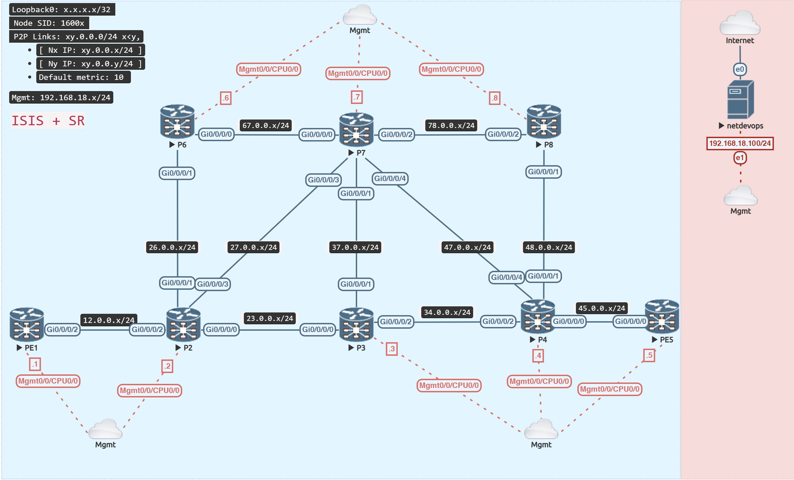

# TI-LFA (Topology Independent - LoopFree Alternate)

<figure markdown>
  { loading=lazy }
  <figcaption>SR Only</figcaption>
</figure>

To offer FRR protection for SR traffic in the data plane, TI-LFA (Topology Independent LoopFree Alternate) would be activated. 

It accomplishes this by generating a backup route for each route in the network.

The post-convergence path is calculated and installed as the backup route in both the route table and the forwarding table by TI-LFA.

## Configuration

=== "PE1"
    ```java
    router isis IGP
     interface GigabitEthernet0/0/0/2
      address-family ipv4 unicast
       fast-reroute per-prefix
       fast-reroute per-prefix ti-lfa
    ```

=== "P2"
    ```java
    router isis IGP
     interface GigabitEthernet0/0/0/0
      address-family ipv4 unicast
       fast-reroute per-prefix
       fast-reroute per-prefix ti-lfa
      !
     !
     interface GigabitEthernet0/0/0/1
      address-family ipv4 unicast
       fast-reroute per-prefix
       fast-reroute per-prefix ti-lfa
      !
     !
     interface GigabitEthernet0/0/0/2
      address-family ipv4 unicast
       fast-reroute per-prefix
       fast-reroute per-prefix ti-lfa
      !
     !
     interface GigabitEthernet0/0/0/3
      address-family ipv4 unicast
       fast-reroute per-prefix
       fast-reroute per-prefix ti-lfa
    ```

=== "P3"
    ```java
    router isis IGP
     interface GigabitEthernet0/0/0/0
      address-family ipv4 unicast
       fast-reroute per-prefix
       fast-reroute per-prefix ti-lfa
      !
     !
     interface GigabitEthernet0/0/0/1
      address-family ipv4 unicast
       fast-reroute per-prefix
       fast-reroute per-prefix ti-lfa
      !
     !
     interface GigabitEthernet0/0/0/2
      address-family ipv4 unicast
       fast-reroute per-prefix
       fast-reroute per-prefix ti-lfa
    ```

=== "P4"
    ```java
    router isis IGP
     interface GigabitEthernet0/0/0/0
      address-family ipv4 unicast
       fast-reroute per-prefix
       fast-reroute per-prefix ti-lfa
      !
     !
     interface GigabitEthernet0/0/0/1
      address-family ipv4 unicast
       fast-reroute per-prefix
       fast-reroute per-prefix ti-lfa
      !
     !
     interface GigabitEthernet0/0/0/2
      address-family ipv4 unicast
       fast-reroute per-prefix
       fast-reroute per-prefix ti-lfa
      !
     !
     interface GigabitEthernet0/0/0/4
      address-family ipv4 unicast
       fast-reroute per-prefix
       fast-reroute per-prefix ti-lfa
    ```

=== "PE5"
    ```java
    router isis IGP
     interface GigabitEthernet0/0/0/0
      address-family ipv4 unicast
       fast-reroute per-prefix
       fast-reroute per-prefix ti-lfa
    ```

=== "P6"
    ```java
    router isis IGP
     interface GigabitEthernet0/0/0/0
      address-family ipv4 unicast
       fast-reroute per-prefix
       fast-reroute per-prefix ti-lfa
      !
     !
     interface GigabitEthernet0/0/0/1
      address-family ipv4 unicast
       fast-reroute per-prefix
       fast-reroute per-prefix ti-lfa
    ```

=== "P7"
    ```java
    router isis IGP
     interface GigabitEthernet0/0/0/0
      address-family ipv4 unicast
       fast-reroute per-prefix
       fast-reroute per-prefix ti-lfa
      !
     !
     interface GigabitEthernet0/0/0/1
      address-family ipv4 unicast
       fast-reroute per-prefix
       fast-reroute per-prefix ti-lfa
      !
     !
     interface GigabitEthernet0/0/0/2
      address-family ipv4 unicast
       fast-reroute per-prefix
       fast-reroute per-prefix ti-lfa
      !
     !
     interface GigabitEthernet0/0/0/3
      address-family ipv4 unicast
       fast-reroute per-prefix
       fast-reroute per-prefix ti-lfa
      !
     !
     interface GigabitEthernet0/0/0/4
      address-family ipv4 unicast
       fast-reroute per-prefix
       fast-reroute per-prefix ti-lfa
    ```

=== "P8"
    ```java
    router isis IGP
     interface GigabitEthernet0/0/0/1
      address-family ipv4 unicast
       fast-reroute per-prefix
       fast-reroute per-prefix ti-lfa
      !
     !
     interface GigabitEthernet0/0/0/2
      address-family ipv4 unicast
       fast-reroute per-prefix
       fast-reroute per-prefix ti-lfa
    ```


## Verify

=== "TI-LFA Active"
```java
RP/0/RP0/CPU0:P2#show isis interface GigabitEthernet 0/0/0/0
Wed Feb  1 06:32:38.963 UTC

GigabitEthernet0/0/0/0      Enabled
  Adjacency Formation:      Enabled
  Prefix Advertisement:     Enabled
  IPv4 BFD:                 Disabled
  IPv6 BFD:                 Disabled
  BFD Min Interval:         150
  BFD Multiplier:           3
  RSI SRLG:                 Registered
  Bandwidth:                1000000

  Circuit Type:             level-2-only
  Media Type:               P2P
  Circuit Number:           0
  Measured Delay:           Min:- Avg:- Max:- usec
  Delay Normalization:      Interval:0 Offset:0
  Normalized Delay:         Min:- Avg:- Max:- usec
  Link Loss:                -
  Extended Circuit Number:  7
  Next P2P IIH in:          3 s
  LSP Rexmit Queue Size:    0

  Level-2
    Adjacency Count:        1
    LSP Pacing Interval:    33 ms
    PSNP Entry Queue Size:  0
    Hello Interval:         10 s
    Hello Multiplier:       3

  CLNS I/O
    Protocol State:         Up
    MTU:                    1497
    SNPA:                   5005.0004.0003
    Layer-2 MCast Groups Membership:
      All ISs:              Yes

  IPv4 Unicast Topology:    Enabled
    Adjacency Formation:    Running
    Prefix Advertisement:   Running
          Policy (L1/L2):   -/-
    Metric (L1/L2):         0/10
    Metric fallback:
      Bandwidth (L1/L2):    Inactive/Inactive
      Anomaly (L1/L2):      Inactive/Inactive
    Weight (L1/L2):         0/0
    MPLS Max Label Stack:   3/3/10/10 (PRI/BKP/SRTE/SRAT)
    MPLS LDP Sync (L1/L2):  Disabled/Disabled
    FRR (L1/L2):            L1 Enabled         L2 Enabled 
      FRR Type:             per-prefix         per-prefix
      Direct LFA:           Enabled            Enabled
      Remote LFA:           Not Enabled        Not Enabled
       Tie Breaker          Default            Default
       Line-card disjoint   30                 30
       Lowest backup metric 20                 20
       Node protecting      40                 40
       Primary path         10                 10
      TI LFA:               Enabled            Enabled  // (1)
       Tie Breaker          Default            Default
       Link Protecting      Enabled            Enabled  // (2)
       Line-card disjoint   0                  0     
       Node protecting      0                  0        // (3)
       SRLG disjoint        0                  0

  IPv4 Address Family:      Enabled
    Protocol State:         Up
    Forwarding Address(es): 23.0.0.2
    Global Prefix(es):      23.0.0.0/24

  LSP transmit timer expires in 0 ms
  LSP transmission is idle
  Can send up to 9 back-to-back LSPs in the next 0 ms

RP/0/RP0/CPU0:P2#
```

1. TI-LFA is enabled now on the interface
2. Link Protection is the default protection mode in TI-LFA
3. Node and SRLG protection would be enabled later on in the guide

=== "Backup Path"
```java
RP/0/RP0/CPU0:P2#show isis fast-reroute 5.5.5.5/32 detail
Wed Feb  1 06:34:56.805 UTC

L2 5.5.5.5/32 [30/115] Label: 16005, medium priority
   Installed Feb 01 06:30:04.625 for 00:04:52
     via 23.0.0.3, GigabitEthernet0/0/0/0, Label: 16005, P3, SRGB Base: 16000, Weight: 0
       Backup path: LFA, via 27.0.0.7, GigabitEthernet0/0/0/3, Label: 16005, P7, SRGB Base: 16000, Weight: 0, Metric: 30
       P: Yes, TM: 30, LC: No, NP: Yes, D: Yes, SRLG: Yes
     via 27.0.0.7, GigabitEthernet0/0/0/3, Label: 16005, P7, SRGB Base: 16000, Weight: 0
       Backup path: LFA, via 23.0.0.3, GigabitEthernet0/0/0/0, Label: 16005, P3, SRGB Base: 16000, Weight: 0, Metric: 30
       P: Yes, TM: 30, LC: No, NP: Yes, D: Yes, SRLG: Yes
     src PE5.00-00, 5.5.5.5, prefix-SID index 5, R:0 N:1 P:0 E:0 V:0 L:0, Alg:0
RP/0/RP0/CPU0:P2#

RP/0/RP0/CPU0:P2#show route 5.5.5.5/32
Wed Feb  1 06:35:42.620 UTC

Routing entry for 5.5.5.5/32
  Known via "isis IGP", distance 115, metric 30, labeled SR, type level-2
  Installed Feb  1 06:30:04.626 for 00:05:38
  Routing Descriptor Blocks
    23.0.0.3, from 5.5.5.5, via GigabitEthernet0/0/0/0, Protected, ECMP-Backup (Local-LFA)
      Route metric is 30
    27.0.0.7, from 5.5.5.5, via GigabitEthernet0/0/0/3, Protected, ECMP-Backup (Local-LFA)
      Route metric is 30
  No advertising protos.
RP/0/RP0/CPU0:P2#
```
