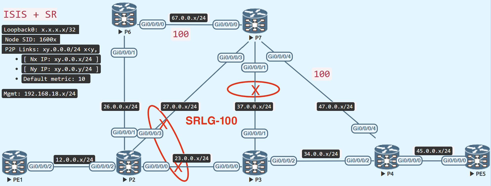

# TI-LFA Global Weighted SRLG Protection

<figure markdown>
  { loading=lazy }
  <figcaption>TI-LFA Global Weighted SRLG Protection</figcaption>
</figure>

If a distant connection with the same SRLG but not directly linked to P2 was included in the backup path computation, the local SRLG protection would fail.

By incorporating all SRLG links in a region, Global Weighted SRLG provides superior protection.

SRLG information can be advertised in ISIS, or static SRLGs (out of scope) can be configured manually for distant connectivity.

Include P7 - P3 in the same SRLG group 100 as the other two connections.

## Configuration

=== "Enable Global Weighted SRLG on P2"
```java
router isis IGP
 address-family ipv4 unicast
  fast-reroute per-prefix srlg-protection weighted-global
```

=== "Advertise SRLG from P7"
    ```java
    srlg
     interface GigabitEthernet0/0/0/1
      name SRLG-100
     !
     name SRLG-100
      value 100
    
    router isis IGP address-family ipv4 unicast advertise application lfa link-attributes srlg
    ```

## Verify
P6 is located in P-space (or P-node) (P2 can send the traffic to P6 without any risk of flowing via P2 – P3)

P7 is located in Q-space (or Q-node) (P7 can send the traffic to the destination without any risk of flowing via P2 – P3)

The backup path on P2 reveals two extra Adj-SID labels 24019 and 24014 to compel the traffic to use P6 - P7 and then P7 - P4 link, due to SRLG protection.

TI-LFA employs the Application Specific SRLG mentioned in TLV 238.

!!! note "MPLS SRLG"
    RSVP-TE uses the MPLS SRLG advertised in TLV 138, TI-LFA does not use it

```java
RP/0/RP0/CPU0:P2#show isis database verbose internal P7
<..snipped..>
  TLV code:138 length:20
    MPLS SRLG:      P3.00
      Local Interface ID: 8
      Remote Interface ID: 8
      Flags: 0x0
      SRLGs:
        [0]: 100
  TLV code:238 length:26
    Application Specific SRLG: P3.00
      L flag: 0, SA-Length 1, UDA-Length 1
      Standard Applications: 0x20 LFA
      User Defined Applications: 0x20 LFA
      Sub-TLV Length: 10
        SubTLV code:4 length:8
          Local Interface ID: 8, Remote Interface ID: 8
      SRLGs:
        [0]: 100

 Total Level-2 LSP count: 1     Local Level-2 LSP count: 0
RP/0/RP0/CPU0:P2#
```

Because the P7 - P3 connection exceeds the mpls max label stack 3, the SRLG-based TI-LFA initiates an SR auto-tunnel as a backup route.

If [mpls traffic-engineering](mpls_traffic_eng.md) is not enabled as indicated in the handbook, the auto-tunnel will not appear.

=== "Global Weighted SRLG Protection TI-LFA"
```java
RP/0/RP0/CPU0:P2#show isis fast-reroute 5.5.5.5/32 detail
Wed Feb  1 09:37:45.061 UTC

L2 5.5.5.5/32 [30/115] Label: 16005, medium priority
   Installed Feb 01 09:33:14.976 for 00:04:31
     via 23.0.0.3, GigabitEthernet0/0/0/0, Label: 16005, P3, SRGB Base: 16000, Weight: 0
       Backup path: TI-LFA (srlg), via 26.0.0.6, GigabitEthernet0/0/0/1 P6, SRGB Base: 16000, Weight: 0, Metric: 220
       Backup tunnel: tunnel-te32768
         P node: P6.00 [6.6.6.6], Label: ImpNull
         Q node: P7.00 [7.7.7.7], Label: 24019
         Q node: P4.00 [4.4.4.4], Label: 24014
         Prefix label: 16005
         Backup-src: PE5.00
       P: No, TM: 220, LC: No, NP: No, D: No, SRLG: Yes
     src PE5.00-00, 5.5.5.5, prefix-SID index 5, R:0 N:1 P:0 E:0 V:0 L:0, Alg:0
RP/0/RP0/CPU0:P2#
```

## Restore Topology
=== "Remove GW-SRLG on P2"
    ```java
    router isis IGP
     address-family ipv4 unicast
      no fast-reroute per-prefix srlg-protection weighted-global
    ```
=== "Stop advertising SRLG on P7"
    ```java
    no router isis IGP address-family ipv4 unicast advertise application lfa link-attributes srlg
    ```

