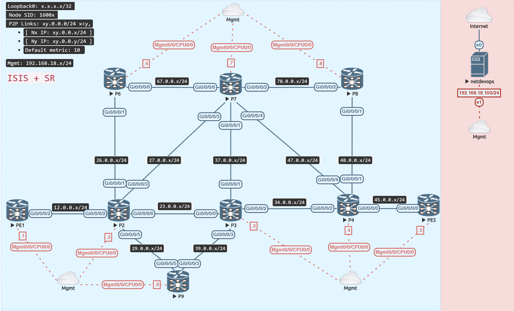
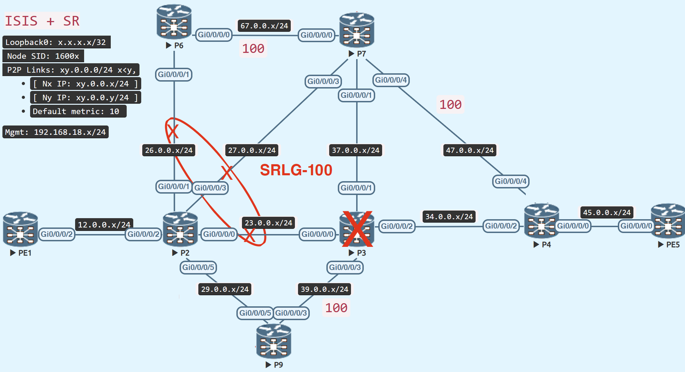

# TI-LFA Tiebreaker (Link vs SRLG vs Node)

<figure markdown>
  { loading=lazy }
  <figcaption>SR + TI-LFA Base Topology</figcaption>
</figure>


## Prepare Topology
Add a new router, P9, to the old topology and configure it for SR-MPLS and TI-LFA.

=== "P9"
    ```java
    interface Loopback0
     ipv4 address 9.9.9.9 255.255.255.255
    !
    interface GigabitEthernet0/0/0/3
     ipv4 address 39.0.0.9 255.255.255.0
     no shutdown
    !
    interface GigabitEthernet0/0/0/5
     ipv4 address 29.0.0.9 255.255.255.0
     no shutdown
    !
    router isis IGP
     is-type level-2-only
     net 49.0000.0000.0009.00
     log adjacency changes
     address-family ipv4 unicast
      metric-style wide level 2
      segment-routing mpls sr-prefer
     !
     interface Loopback0
      passive
      address-family ipv4 unicast
       prefix-sid index 9
      !
     !
     interface GigabitEthernet0/0/0/3
      circuit-type level-2-only
      point-to-point
      hello-padding disable
      address-family ipv4 unicast
       fast-reroute per-prefix
       fast-reroute per-prefix ti-lfa
       metric 10
      !
     !
     interface GigabitEthernet0/0/0/5
      circuit-type level-2-only
      point-to-point
      hello-padding disable
      address-family ipv4 unicast
       fast-reroute per-prefix
       fast-reroute per-prefix ti-lfa
       metric 10
      !
     !
    !
    mpls oam
    ```

=== "P2"
    ```java
    
    interface GigabitEthernet0/0/0/5
     ipv4 address 29.0.0.2 255.255.255.0
     no shutdown
    !
    router isis IGP
     interface GigabitEthernet0/0/0/5
      circuit-type level-2-only
      point-to-point
      hello-padding disable
      address-family ipv4 unicast
       fast-reroute per-prefix
       fast-reroute per-prefix ti-lfa
       metric 10
    ```

=== "P3"
    ```java
    interface GigabitEthernet0/0/0/3
     ipv4 address 39.0.0.3 255.255.255.0
     no shutdown
    !
    router isis IGP
     interface GigabitEthernet0/0/0/3
      circuit-type level-2-only
      point-to-point
      hello-padding disable
      address-family ipv4 unicast
       fast-reroute per-prefix
       fast-reroute per-prefix ti-lfa
       metric 10
    ```

## Link Protection Preferred


Add the link between P2 and P6 to the same SRLG group as P2 and P7 and P2 and P3.

=== "P2"
    ```java
    srlg
     interface GigabitEthernet0/0/0/1
      name SRLG-100
    ```

=== "Node+SRLG already configured on P2"
    ```java
    RP/0/RP0/CPU0:P2#show run router isis
    Tue Feb 1 12:02:21.985 UTC
    router isis IGP
    <..snipped..>
      fast-reroute per-prefix tiebreaker node-protecting index 200
      fast-reroute per-prefix tiebreaker srlg-disjoint index 100
    ```


<figure markdown>
  { loading=lazy }
  <figcaption>TI-LFA Link Protection Path Preferred</figcaption>
</figure>

!!! warning "Link Protection Index"
    We cannot adjust the lowest index (or maximum preference) for link protection.


=== "P2 to PE5 primary path"
    + P2 – P3 – P4 – PE5 (metric: 30)

---
=== "The backup route computation from P2 to PE5 is as follows:"

| Protection | Via | Path                 | Metric  | Preference                 |
| ---------- | --- | -------------------- | ------: | :------------------------- |
| Link       |  P9 | P9 – P3 – P4 – PE5   | 40      | :material-check-all: 1st   |
| SRLG       |  P9 | P9 – P3 – P4 – PE5   | 40      | 2nd                        |
| Node       |  P7 | P7 – P4 – PE5        | 120     | 3rd                        |

!!! tip "Link Protection Preferred"
    Because node and srlg protection are not available concurrently, the tiebreaker chooses link protection computation as the best backup path, therefore ti-lfa falls back to link protection.

=== "Link Protection Preferred"
```java
RP/0/RP0/CPU0:P2#show isis fast-reroute 5.5.5.5/32 detail
Wed Feb  1 12:12:11.367 UTC

L2 5.5.5.5/32 [30/115] Label: 16005, medium priority
   Installed Feb 01 12:12:05.762 for 00:00:06
     via 23.0.0.3, GigabitEthernet0/0/0/0, Label: 16005, P3, SRGB Base: 16000, Weight: 0
       Backup path: LFA, via 29.0.0.9, GigabitEthernet0/0/0/5, Label: 16005, P9, SRGB Base: 16000, Weight: 0, Metric: 40
       P: No, TM: 40, LC: No, NP: No, D: No, SRLG: Yes
     src PE5.00-00, 5.5.5.5, prefix-SID index 5, R:0 N:1 P:0 E:0 V:0 L:0, Alg:0
RP/0/RP0/CPU0:P2#

RP/0/RP0/CPU0:P2#show route 5.5.5.5/32
Wed Feb  1 12:12:17.549 UTC

Routing entry for 5.5.5.5/32
  Known via "isis IGP", distance 115, metric 30, labeled SR, type level-2
  Installed Feb  1 12:12:05.762 for 00:00:11
  Routing Descriptor Blocks
    23.0.0.3, from 5.5.5.5, via GigabitEthernet0/0/0/0, Protected
      Route metric is 30
    29.0.0.9, from 5.5.5.5, via GigabitEthernet0/0/0/5, Backup (Local-LFA)
      Route metric is 40
  No advertising protos.
RP/0/RP0/CPU0:P2#

RP/0/RP0/CPU0:P2#show cef 5.5.5.5/32
Wed Feb  1 12:12:55.469 UTC
5.5.5.5/32, version 1340, labeled SR, internal 0x1000001 0x8310 (ptr 0xe727de0) [1], 0x600 (0xe190578), 0xa28 (0xf559100)
 Updated Feb  1 12:12:05.768
 remote adjacency to GigabitEthernet0/0/0/0
 Prefix Len 32, traffic index 0, precedence n/a, priority 1
  gateway array (0xdffae98) reference count 6, flags 0x500068, source rib (7), 1 backups
                [3 type 5 flags 0x8401 (0xeb74608) ext 0x0 (0x0)]
  LW-LDI[type=5, refc=3, ptr=0xe190578, sh-ldi=0xeb74608]
  gateway array update type-time 1 Feb  1 12:12:05.767
 LDI Update time Feb  1 12:12:05.767
 LW-LDI-TS Feb  1 12:12:05.767
   via 23.0.0.3/32, GigabitEthernet0/0/0/0, 10 dependencies, weight 0, class 0, protected [flags 0x400]
    path-idx 0 bkup-idx 1 NHID 0x0 [0xdda6ea0 0x0]
    next hop 23.0.0.3/32
     local label 16005      labels imposed {16005}
   via 29.0.0.9/32, GigabitEthernet0/0/0/5, 21 dependencies, weight 0, class 0, backup (Local-LFA) [flags 0x300]
    path-idx 1 NHID 0x0 [0xf399f10 0x0]
    next hop 29.0.0.9/32
    remote adjacency
     local label 16005      labels imposed {16005}

    Load distribution: 0 (refcount 3)

    Hash  OK  Interface                 Address
    0     Y   GigabitEthernet0/0/0/0    remote
RP/0/RP0/CPU0:P2(config)#
```


## SRLG Protection Preferred

Increase the metric between P9 and P3, such that link protection is no longer available.

=== "P9"
    ```java
    router isis IGP
     interface GigabitEthernet0/0/0/3
      address-family ipv4 unicast
       metric 100
    ```

<figure markdown>
  { loading=lazy }
  <figcaption>TI-LFA SRLG Protection Path Preferred</figcaption>
</figure>


=== "P2 to PE5 primary path"
    + P2 – P3 – P4 – PE5 (metric: 30)

---
=== "The backup route computation from P2 to PE5 is as follows:"

| Protection | Via | Path                 | Metric  | Preference                 |
| ---------- | --- | -------------------- | ------: | :------------------------- |
| Link	     | P7  | P7 – P4 – PE5	  | 120	    | NA (path has SRLG)         |
| SRLG	     | P9  | P9 – P3 – P4 – PE5	  | 130	    | :material-check-all: 1st   |
| Node	     | P7  | P7 – P4 – PE5	  | 120	    | 2nd                        |

!!! tip "SRLG Protection Preferred"
    Because link protection alone is not available owing to clashes with SRLG links, and SRLG has a higher priority or lower index than Node protection, the tiebreaker favours SRLG-disjoint protection computation as the best backup option.


=== "SRLG Protection Preferred"
```java
RP/0/RP0/CPU0:P2#show isis fast-reroute 5.5.5.5/32 detail
Wed Feb  1 12:16:47.226 UTC

L2 5.5.5.5/32 [30/115] Label: 16005, medium priority
   Installed Feb 01 12:13:34.896 for 00:03:13
     via 23.0.0.3, GigabitEthernet0/0/0/0, Label: 16005, P3, SRGB Base: 16000, Weight: 0
       Backup path: TI-LFA (srlg), via 29.0.0.9, GigabitEthernet0/0/0/5 P9, SRGB Base: 16000, Weight: 0, Metric: 130
         P node: P9.00 [9.9.9.9], Label: ImpNull
         Q node: P3.00 [3.3.3.3], Label: 24001
         Prefix label: 16005
         Backup-src: PE5.00
       P: No, TM: 130, LC: No, NP: No, D: No, SRLG: Yes
     src PE5.00-00, 5.5.5.5, prefix-SID index 5, R:0 N:1 P:0 E:0 V:0 L:0, Alg:0
RP/0/RP0/CPU0:P2#

RP/0/RP0/CPU0:P2#show route 5.5.5.5/32
Wed Feb  1 12:16:56.680 UTC

Routing entry for 5.5.5.5/32
  Known via "isis IGP", distance 115, metric 30, labeled SR, type level-2
  Installed Feb  1 12:13:34.897 for 00:03:21
  Routing Descriptor Blocks
    23.0.0.3, from 5.5.5.5, via GigabitEthernet0/0/0/0, Protected
      Route metric is 30
    29.0.0.9, from 5.5.5.5, via GigabitEthernet0/0/0/5, Backup (TI-LFA)
      Repair Node(s): 9.9.9.9, 3.3.3.3
      Route metric is 130
  No advertising protos.
RP/0/RP0/CPU0:P2#

RP/0/RP0/CPU0:P2#show cef 5.5.5.5/32
Wed Feb  1 12:17:07.318 UTC
5.5.5.5/32, version 1371, labeled SR, internal 0x1000001 0x8310 (ptr 0xe727de0) [1], 0x600 (0xe191460), 0xa28 (0xf559628)
 Updated Feb  1 12:13:34.914
 remote adjacency to GigabitEthernet0/0/0/0
 Prefix Len 32, traffic index 0, precedence n/a, priority 1
  gateway array (0xdffb890) reference count 6, flags 0x500068, source rib (7), 1 backups
                [5 type 4 flags 0x8401 (0xeb74008) ext 0x0 (0x0)]
  LW-LDI[type=1, refc=1, ptr=0xe191460, sh-ldi=0xeb74008]
  gateway array update type-time 1 Feb  1 12:13:34.914
 LDI Update time Feb  1 12:13:34.914
 LW-LDI-TS Feb  1 12:13:34.914
   via 23.0.0.3/32, GigabitEthernet0/0/0/0, 14 dependencies, weight 0, class 0, protected [flags 0x400]
    path-idx 0 bkup-idx 1 NHID 0x0 [0xdda6ea0 0xdda6ea0]
    next hop 23.0.0.3/32
     local label 16005      labels imposed {16005}
   via 29.0.0.9/32, GigabitEthernet0/0/0/5, 22 dependencies, weight 0, class 0, backup (TI-LFA) [flags 0xb00]
    path-idx 1 NHID 0x0 [0xf399f10 0x0]
    next hop 29.0.0.9/32, Repair Node(s): 9.9.9.9, 3.3.3.3
    remote adjacency
     local label 16005      labels imposed {ImplNull 24001 16005}

    Load distribution: 0 (refcount 5)

    Hash  OK  Interface                 Address
    0     Y   GigabitEthernet0/0/0/0    remote
RP/0/RP0/CPU0:P2#
```

## Node Protection Preferred

Increase the SRLG index to make node-protection the preferable option.

=== "P2"
    ```java
    router isis IGP
     address-family ipv4 unicast
      fast-reroute per-prefix tiebreaker srlg-disjoint index 255
    ```
<figure markdown>
  { loading=lazy }
  <figcaption>TI-LFA NODE Protection Path Preferred</figcaption>
</figure>


=== "P2 to PE5 primary path"
    + P2 – P3 – P4 – PE5 (metric: 30)

---
=== "The backup route computation from P2 to PE5 is as follows:"

| Protection | Via | Path                 | Metric  | Preference                 |
| ---------- | --- | -------------------- | ------: | :------------------------- |
| Link	     | P7  | P7 – P4 – PE5	  |   120   | NA (path has SRLG)         |
| SRLG	     | P9  | P9 – P3 – P4 – PE5	  |   130   | 2nd                        |
| Node	     | P7  | P7 – P4 – PE5	  |   120   | :material-check-all: 1st   |

!!! tip "Node Protection Preferred"
    Because it has a lower index or higher priority than SRLG, the tiebreaker selects Node protection calculation as the optimal backup path. Furthermore, link protection is not available on its own.

=== "Node Protection Preferred"
```java
RP/0/RP0/CPU0:P2#show isis fast-reroute 5.5.5.5/32 detail
Wed Feb  1 12:18:04.104 UTC

L2 5.5.5.5/32 [30/115] Label: 16005, medium priority
   Installed Feb 01 12:17:48.448 for 00:00:16
     via 23.0.0.3, GigabitEthernet0/0/0/0, Label: 16005, P3, SRGB Base: 16000, Weight: 0
       Backup path: TI-LFA (node), via 27.0.0.7, GigabitEthernet0/0/0/3 P7, SRGB Base: 16000, Weight: 0, Metric: 120
         P node: P7.00 [7.7.7.7], Label: ImpNull
         Q node: P4.00 [4.4.4.4], Label: 24014
         Prefix label: 16005
         Backup-src: PE5.00
       P: No, TM: 120, LC: No, NP: Yes, D: No, SRLG: No
     src PE5.00-00, 5.5.5.5, prefix-SID index 5, R:0 N:1 P:0 E:0 V:0 L:0, Alg:0
RP/0/RP0/CPU0:P2#

RP/0/RP0/CPU0:P2#show route 5.5.5.5/32
Wed Feb  1 12:18:17.246 UTC

Routing entry for 5.5.5.5/32
  Known via "isis IGP", distance 115, metric 30, labeled SR, type level-2
  Installed Feb  1 12:17:48.449 for 00:00:28
  Routing Descriptor Blocks
    23.0.0.3, from 5.5.5.5, via GigabitEthernet0/0/0/0, Protected
      Route metric is 30
    27.0.0.7, from 5.5.5.5, via GigabitEthernet0/0/0/3, Backup (TI-LFA)
      Repair Node(s): 7.7.7.7, 4.4.4.4
      Route metric is 120
  No advertising protos.
RP/0/RP0/CPU0:P2#

RP/0/RP0/CPU0:P2#show cef 5.5.5.5/32
Wed Feb  1 12:18:22.190 UTC
5.5.5.5/32, version 1388, labeled SR, internal 0x1000001 0x8310 (ptr 0xe727de0) [1], 0x600 (0xe191460), 0xa28 (0xf559ec0)
 Updated Feb  1 12:17:48.453
 remote adjacency to GigabitEthernet0/0/0/0
 Prefix Len 32, traffic index 0, precedence n/a, priority 1
  gateway array (0xdffa4a0) reference count 6, flags 0x500068, source rib (7), 1 backups
                [5 type 4 flags 0x8401 (0xeb744e8) ext 0x0 (0x0)]
  LW-LDI[type=1, refc=1, ptr=0xe191460, sh-ldi=0xeb744e8]
  gateway array update type-time 1 Feb  1 12:17:48.453
 LDI Update time Feb  1 12:17:48.455
 LW-LDI-TS Feb  1 12:17:48.455
   via 23.0.0.3/32, GigabitEthernet0/0/0/0, 8 dependencies, weight 0, class 0, protected [flags 0x400]
    path-idx 0 bkup-idx 1 NHID 0x0 [0xdda6db0 0xdda6db0]
    next hop 23.0.0.3/32
     local label 16005      labels imposed {16005}
   via 27.0.0.7/32, GigabitEthernet0/0/0/3, 8 dependencies, weight 0, class 0, backup (TI-LFA) [flags 0xb00]
    path-idx 1 NHID 0x0 [0xf39a4b0 0x0]
    next hop 27.0.0.7/32, Repair Node(s): 7.7.7.7, 4.4.4.4
    remote adjacency
     local label 16005      labels imposed {ImplNull 24014 16005}

    Load distribution: 0 (refcount 5)

    Hash  OK  Interface                 Address
    0     Y   GigabitEthernet0/0/0/0    remote
RP/0/RP0/CPU0:P2#
```
