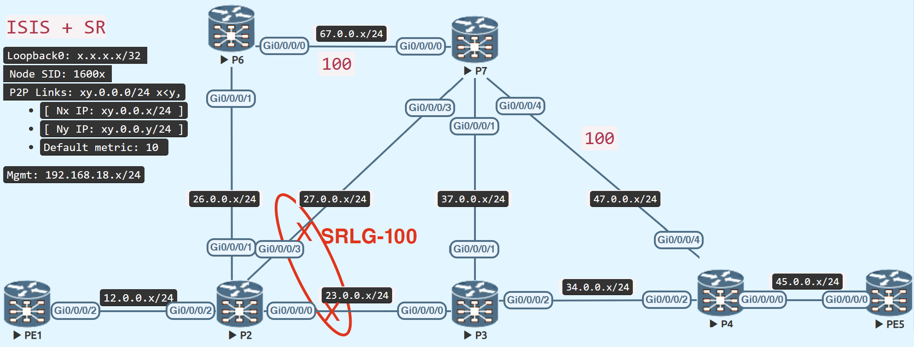

# TI-LFA Local SRLG Disjoint Protection

<figure markdown>
  { loading=lazy }
  <figcaption>TI-LFA Local SRLG Disjoint Protection</figcaption>
</figure>

When two or more connections share a common transmission risk, they constitute an SRLG (Share Risk Link Group). Once identified, the SRLGs are applied to the appropriate router interfaces.

The local SRLG disjoint is covered in this part, but the SRLG-based TI-LFA backup path just analyses the directly linked SRLG connections.

There is an SRLG on P2 in the aforementioned topology for the P2 - P7 and P2 - P3 links.

Create an SRLG group called SRLG-100 and give it the value 100. Configure a fast-reroute tiebreaker for srlg to allow P2 to avoid using SRLG as a backup route.

### Configuration

=== "P2"
```java
srlg
 interface GigabitEthernet0/0/0/0
  name SRLG-100
 !
 interface GigabitEthernet0/0/0/3
  name SRLG-100
 !
 name SRLG-100 value 100
!
router isis IGP
 address-family ipv4 unicast
  fast-reroute per-prefix tiebreaker srlg-disjoint index 100
```

### Verify
P6 is located in P-space (or P-node) (P2 can send the traffic to P6 without any risk of flowing via P2 – P3)

P7 is located in Q-space (or Q-node) (P7 can send the traffic to the destination without any risk of flowing via P2 – P3)

The backup path on P2 reveals that an extra Adj-SID label 24019 is sent towards P6, which is the link between P6 and P7, to compel the router to use that link for traffic forwarding.

In this case, P7 would utilise the P3 node to forward traffic because it is the shortest path to the target.

=== "Local SRLG Disjoint Protection TI-LFA"
```java
RP/0/RP0/CPU0:P2#show isis fast-reroute 5.5.5.5/32 detail
Wed Feb  1 09:09:37.951 UTC

L2 5.5.5.5/32 [30/115] Label: 16005, medium priority
   Installed Feb 01 09:09:22.424 for 00:00:16
     via 23.0.0.3, GigabitEthernet0/0/0/0, Label: 16005, P3, SRGB Base: 16000, Weight: 0
       Backup path: TI-LFA (srlg), via 26.0.0.6, GigabitEthernet0/0/0/1 P6, SRGB Base: 16000, Weight: 0, Metric: 140
         P node: P6.00 [6.6.6.6], Label: ImpNull
         Q node: P7.00 [7.7.7.7], Label: 24019
         Prefix label: 16005
         Backup-src: PE5.00
       P: No, TM: 140, LC: No, NP: No, D: No, SRLG: Yes
     src PE5.00-00, 5.5.5.5, prefix-SID index 5, R:0 N:1 P:0 E:0 V:0 L:0, Alg:0
RP/0/RP0/CPU0:P2#
```

