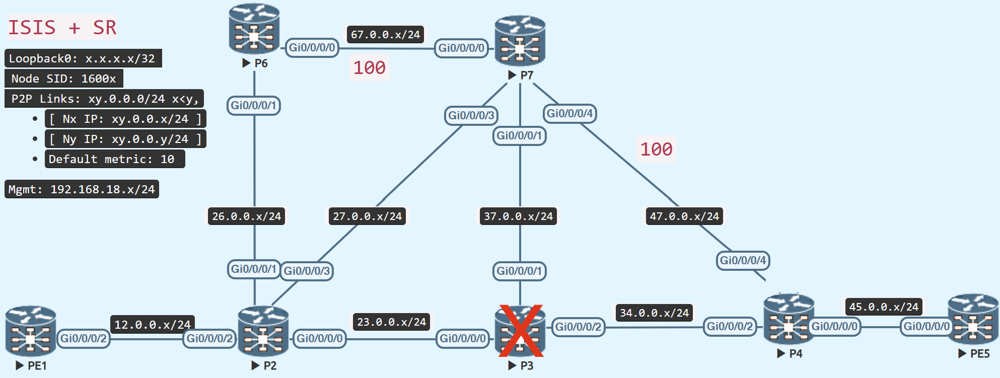

# TI-LFA Node Protection

<figure markdown>
  { loading=lazy }
  <figcaption>TI-LFA Node Protection</figcaption>
</figure>

Configure P2 in the topology for node protection such that the backup route bypasses P3 for the primary connection P2 - P3 to reach the destination PE5.

## Configuration

=== "P2"
```java
router isis IGP
 address-family ipv4 unicast
  fast-reroute per-prefix tiebreaker node-protecting index 200
```

P7 is located in P-space (or P-node) (P2 can send the traffic to P7 without any risk of flowing it via P2 – P3)

P4 is located in Q-space (or Q-node) (P4 can send the traffic to the destination without any risk of it flowing through P2 – P3)

### Verify

The shortest route from P7 to PE5 is through P3.

Because node protection is enabled on P2, it constructs a backup path that bypasses P3.

As a result, P2's backup route has the Adj-SID label 24014, which is the Adj-SID label for P7 - P4.

=== "Node Protection TI-LFA"

    ```java
    RP/0/RP0/CPU0:P2#sh isis fast-reroute 5.5.5.5/32 detail
    Wed Feb  1 08:16:00.944 UTC
    
    L2 5.5.5.5/32 [30/115] Label: 16005, medium priority
       Installed Feb 01 08:15:51.907 for 00:00:10
         via 23.0.0.3, GigabitEthernet0/0/0/0, Label: 16005, P3, SRGB Base: 16000, Weight: 0
           Backup path: TI-LFA (node), via 27.0.0.7, GigabitEthernet0/0/0/3 P7, SRGB Base: 16000, Weight: 0, Metric: 120
             P node: P7.00 [7.7.7.7], Label: ImpNull
             Q node: P4.00 [4.4.4.4], Label: 24014
             Prefix label: 16005
             Backup-src: PE5.00
           P: No, TM: 120, LC: No, NP: Yes, D: No, SRLG: Yes
         src PE5.00-00, 5.5.5.5, prefix-SID index 5, R:0 N:1 P:0 E:0 V:0 L:0, Alg:0
    RP/0/RP0/CPU0:P2#
    ```


### Restore Topology
=== "Remove Node Protection (P2)"

```java
router isis IGP
 address-family ipv4 unicast
  no fast-reroute per-prefix tiebreaker node-protecting index 200
```


