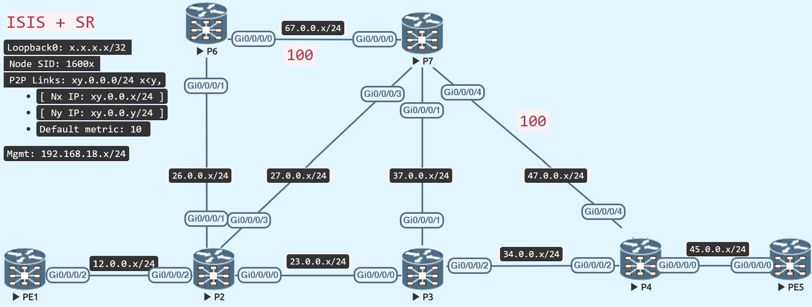

# TI-LFA Node and SRLG Protection

<figure markdown>
  { loading=lazy }
  <figcaption>TI-LFA Node and SRLG Protection Topology</figcaption>
</figure>

By default, TI-LFA allows link protection; to activate it for node protection and srlg, a fast-reroute tiebreaker is necessary.
Link protection is already seen in instances of Single Segment TI-LFA and Double Segment TI-LFA.

As a first step, raise the metric on the P6 - P7 and P7 - P4 links to 100 and disable peering on P8 to isolate it from the network.


=== "P6"
    ```java
    router isis IGP
    interface GigabitEthernet0/0/0/0
      address-family ipv4 unicast
       metric 100
    ```

=== "P7"
    ```java
    router isis IGP
     interface GigabitEthernet0/0/0/0
      address-family ipv4 unicast
       metric 100
      !
     !
     interface GigabitEthernet0/0/0/4
      address-family ipv4 unicast
       metric 100
    ```

=== "P4"
    ```java
    router isis IGP
     interface GigabitEthernet0/0/0/4
      address-family ipv4 unicast
       metric 100
    ```

=== "P8"
    ```java
    router isis IGP
     interface GigabitEthernet0/0/0/1
      shutdown
     !
     interface GigabitEthernet0/0/0/2
      shutdown
    ```

