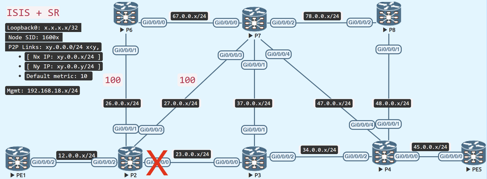

# Zero Segment TI-LFA (Topology Independent - LoopFree Alternate)

<figure markdown>
  { loading=lazy }
  <figcaption>Zero Segment TI-LFA</figcaption>
</figure>

The Zero Segment TI-LFA backup route allows the router, in the event of a local failure, to transfer traffic through a backup connection without adding any further segments to the original packet.


## Prepare the topology
Increase the metric between P2 - P6 and P2 - P7 in the illustrated topology to 100, while all other links have the default metric of 10.

To protect the link between P2 and P3, the P2 router now has a backup route via P7 to PE5, which is the post-convergence path in the case of the aforementioned link failure.


=== "P2"
    ```java
    router isis IGP
     interface GigabitEthernet0/0/0/1
      address-family ipv4 unicast
       metric 100
      !
     !
     interface GigabitEthernet0/0/0/3
      address-family ipv4 unicast
       metric 100
    ```

=== "P6"
    ```java
    router isis IGP
     interface GigabitEthernet0/0/0/1
      address-family ipv4 unicast
       metric 100
    ```

=== "P7"
    ```java
    router isis IGP
     interface GigabitEthernet0/0/0/3
      address-family ipv4 unicast
       metric 100
    ```

## Verify

The backup is via P7, with no additional label applied, because P7 can reach PE5 without traversing the P2 - P3 link, which would also become the post-convergence path for P2 to PE5 in the event of a local failure towards P3.

P2 may give over the original segment, which is the Prefix-SID of PE5, to its immediate neighbour P7, it can then forward it to PE5 without risk of it travelling across the P2 - P3 link. As a result, no extra segment was enforced to direct traffic to the backup route.

=== "Zero Segment TI-LFA"
!!! info "Zero Segment TI-LFA"
    No additional segment required in the backup path.
```java
RP/0/RP0/CPU0:P2#show isis route 5.5.5.5/32 detail
Wed Feb  1 07:25:32.432 UTC

L2 5.5.5.5/32 [30/115] Label: 16005, medium priority
   Installed Feb 01 07:24:43.731 for 00:00:49
     via 23.0.0.3, GigabitEthernet0/0/0/0, Label: 16005, P3, SRGB Base: 16000, Weight: 0
     src PE5.00-00, 5.5.5.5, prefix-SID index 5, R:0 N:1 P:0 E:0 V:0 L:0, Alg:0
RP/0/RP0/CPU0:P2#

RP/0/RP0/CPU0:P2#show isis fast-reroute 5.5.5.5/32 detail
Wed Feb  1 07:25:46.923 UTC

L2 5.5.5.5/32 [30/115] Label: 16005, medium priority
   Installed Feb 01 07:24:43.731 for 00:01:04
     via 23.0.0.3, GigabitEthernet0/0/0/0, Label: 16005, P3, SRGB Base: 16000, Weight: 0
       Backup path: LFA, via 27.0.0.7, GigabitEthernet0/0/0/3, Label: 16005, P7, SRGB Base: 16000, Weight: 0, Metric: 120
       P: No, TM: 120, LC: No, NP: Yes, D: Yes, SRLG: Yes
     src PE5.00-00, 5.5.5.5, prefix-SID index 5, R:0 N:1 P:0 E:0 V:0 L:0, Alg:0
RP/0/RP0/CPU0:P2#

RP/0/RP0/CPU0:P2#show route 5.5.5.5/32
Wed Feb  1 07:25:55.436 UTC

Routing entry for 5.5.5.5/32
  Known via "isis IGP", distance 115, metric 30, labeled SR, type level-2
  Installed Feb  1 07:24:43.732 for 00:01:11
  Routing Descriptor Blocks
    23.0.0.3, from 5.5.5.5, via GigabitEthernet0/0/0/0, Protected
      Route metric is 30
    27.0.0.7, from 5.5.5.5, via GigabitEthernet0/0/0/3, Backup (Local-LFA)
      Route metric is 120
  No advertising protos.
RP/0/RP0/CPU0:P2#

RP/0/RP0/CPU0:P2#show cef 5.5.5.5/32
Wed Feb  1 07:26:07.812 UTC
5.5.5.5/32, version 344, labeled SR, internal 0x1000001 0x8310 (ptr 0xe727de0) [1], 0x600 (0xe190578), 0xa28 (0xf54a1b0)
 Updated Feb  1 07:24:43.736
 remote adjacency to GigabitEthernet0/0/0/0
 Prefix Len 32, traffic index 0, precedence n/a, priority 1
  gateway array (0xdff8a58) reference count 9, flags 0x500068, source rib (7), 1 backups
                [4 type 5 flags 0x8401 (0xeb73e88) ext 0x0 (0x0)]
  LW-LDI[type=5, refc=3, ptr=0xe190578, sh-ldi=0xeb73e88]
  gateway array update type-time 1 Feb  1 07:24:43.735
 LDI Update time Feb  1 07:24:43.735
 LW-LDI-TS Feb  1 07:24:43.736
   via 23.0.0.3/32, GigabitEthernet0/0/0/0, 14 dependencies, weight 0, class 0, protected [flags 0x400]
    path-idx 0 bkup-idx 1 NHID 0x0 [0xdda5280 0x0]
    next hop 23.0.0.3/32
     local label 16005      labels imposed {16005}
   via 27.0.0.7/32, GigabitEthernet0/0/0/3, 12 dependencies, weight 0, class 0, backup (Local-LFA) [flags 0x300]
    path-idx 1 NHID 0x0 [0xf399ab0 0x0]
    next hop 27.0.0.7/32
    remote adjacency
     local label 16005      labels imposed {16005}

    Load distribution: 0 (refcount 4)

    Hash  OK  Interface                 Address
    0     Y   GigabitEthernet0/0/0/0    remote
RP/0/RP0/CPU0:P2#
```

## Restore the metrics

Before moving on to the next lab, restore the metric.
=== "P2"
    ```java
    router isis IGP
     interface GigabitEthernet0/0/0/1
      address-family ipv4 unicast
       metric 10
      !
     !
     interface GigabitEthernet0/0/0/3
      address-family ipv4 unicast
       metric 10
    ```

=== "P6"
    ```java
    router isis IGP
     interface GigabitEthernet0/0/0/1
      address-family ipv4 unicast
       metric 10
    ```

=== "P7"
    ```java
    router isis IGP
     interface GigabitEthernet0/0/0/3
      address-family ipv4 unicast
       metric 10
    ```

